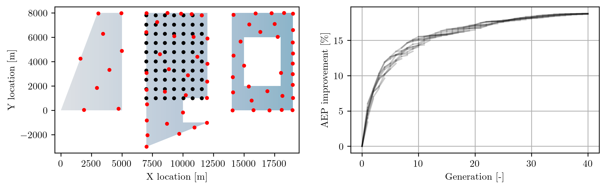

(layout_optimization)=
# Layout Optimization

The FLORIS package provides layout optimization tools to place turbines within a specified
boundary area to optimize annual energy production (AEP) or wind plant value. Layout
optimizers accept an instantiated `FlorisModel` and alter the turbine layouts in order to
improve the objective function value (AEP or value).

## Background

Layout optimization entails placing turbines in a wind farm in a configuration that maximizes
an objective function, usually the AEP. Turbines are moved to minimize their wake interactions
in the most dominant wind directions, while respecting the boundaries of the area for turbine
placement as well as minimum distance requirements between neighboring turbines.

Mathematically, we represent this as a (nonconvex) optimization problem.
Let $x = \{x_i\}_{i=1,\dots,N}$, $x_i \in \mathbb{R}^2$ represent the set of
coordinates of turbines within a farm (that is, $x_i$ represents the $(X, Y)$
location of turbine $i$). Further, let $R \subset \mathbb{R}^2$ be a closed
region in which to place turbines. Finally, let $d$ represent the minimum
allowable distance between two turbines. Then, the layout optimization problem
is expressed as

$$
\begin{aligned}
\underset{x}{\text{maximize}} & \:\: f(x)\\
\text{subject to} & \:\: x \subset R \\
& \:\: ||x_i - x_j|| \geq d \:\: \forall j = 1,\dots,N, j\neq i
\end{aligned}
$$

Here, $||\cdot||$ denotes the Euclidean norm, and $f(x)$ is the cost function to be maximized.

When maximizing the AEP, $f = \sum_w P(w, x)p_W(w)$, where $w$ is the wind condition bin
(e.g., wind speed, wind direction pair); $P(w, x)$ is the power produced by the wind farm in
condition $w$ with layout $x$; and $p_W(w)$ is the annual frequency of occurrence of
condition $w$.

Layout optimizers take iterative approaches to solving the layout optimization problem
specified above. Optimization routines available in FLORIS are described below.

## Scipy layout optimization
The `LayoutOptimizationScipy` class is built around `scipy.optimize`s `minimize`
routine, using the `SLSQP` solver by default. Options for adjusting
`minimize`'s behavior are exposed to the user with the `optOptions` argument.
Other options include enabling fast wake steering at each layout optimizer
iteration with the `enable_geometric_yaw` argument, and switch from AEP
optimization to value optimization with the `use_value` argument.

## Genetic random search layout optimization
The `LayoutOptimizationRandomSearch` class is a custom optimizer designed specifically for
layout optimization via random perturbations of the turbine locations. It is designed to have
the following features:
- Robust to complex wind conditions and complex boundaries, including disjoint regions for
turbine placement
- Easy to parallelize and wrapped in a genetic algorithm for propagating candidate solutions
- Simple to set up and tune for non-optimization experts
- Set up to run cheap constraint checks prior to more expensive objective function evaluations
to accelerate optimization

The algorithm, described in full in {cite:t}`SinnerFleming2024grs`,
moves a random turbine and random distance in a random direction; checks
that constraints are satisfied; evaluates the objective function (AEP or value); and then
commits to the move if there is an objective function improvement. The main tuning parameter
is the probability mass function for the random movement distance, which is a dictionary to be
passed to the `distance_pmf` argument.

The `distance_pmf` dictionary should contain two keys, each containing a 1D array of equal
length: `"d"`, which specifies the perturbation distance _in units of the rotor diameter_,
and `"p"`, which specifies the probability that the corresponding perturbation distance is
chosen at any iteration of the random search algorithm. The `distance_pmf` can therefore be
used to encourage or discourage more aggressive or more conservative movements, and to enable
or disable jumps between disjoint regions for turbine placement.

The figure below shows an example of the optimized layout of a farm using the GRS algorithm, with
the black dots indicating the initial layout; red dots indicating the final layout; and blue
shading indicating wind speed heterogeneity (lighter shade is lower wind speed, darker shade is
higher wind speed). The progress of each of the genetic individuals in the optimization process is
shown in the right-hand plot.

