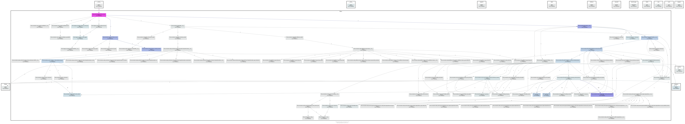
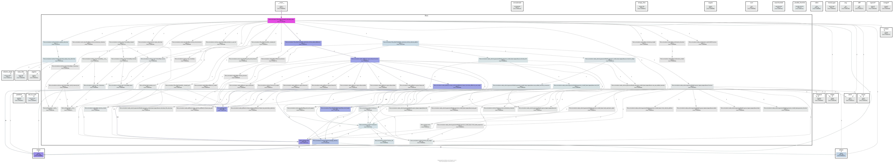

Code Reference
--------------

The FLORIS source code documentation is auto-generated from in-source
docstrings. It is always a work in progress and continuously updated, so please
feel free to contribute!

.. toctree::
    :glob:
    :maxdepth: 1

    classes/floris
    classes/floris.simulation
    classes/floris.tools

FLORIS Initialization
=====================
The primary object in FLORIS is the :py:class:`floris.simulation.floris` class.
A call-graph of the classes and functions used in the FLORIS init method is
included below.

Calculate Wake
==============
After the wind farm, turbine, and wake models are well established, the flow
field is actually calculated by calling
:py:meth:`floris.simulation.flow_field.FlowField.calculate_wake`. A call-graph
of the classes and functions used in this process is included below.

