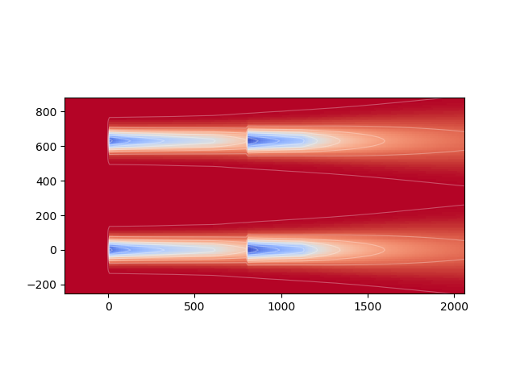

Examples
---------

The FLORIS code includes wake models, and a number of related analysis and visualization tools to be used in
connection with wind farm controls research.  A number of examples are provided in the directory ``examples/``
to provide instruction on the use of most of the underlying codes.

For questions not covered in the examples, or to request additional examples, please first search for or 
submit your questions to stackoverflow.com using the tag FLORIS.  Additionally you can contact 
 `Jen King <mailto:jennifer.king@nrel.gov>`_, `Paul Fleming <mailto:paul.fleming@nrel.gov>`_, or `Rafael Mudafort <mailto:rafael.mudafort@nrel.gov>`_.

FLORIS Input
=====
A sample input file to the Floris model is provided in ``examples/example_input.json``.
This example case uses the NREL 5MW turbine and the Gaussian wake model as a reference.
All model parameters provided have been published in previous work, but the inputs to
in the example input file can be changed as needed. However, be aware that changing these parameters
may result in an unphysical solution.  Many of the example files will make use of this example input.

example_0000_open_and_vis_floris.py
=================
This first example provides an essential introduction to using FLORIS.  A floris model is instantiated,
and a floris interface setup using the example_input.json file.  The model is run using only the 
wind speed and direction specified in the input file and a hub-height visualization is produced.

The first block of code reads in the input file and runs the model without modification

::

    fi = wfct.floris_utilities.FlorisInterface("example_input.json")
    fi.run_floris()

TODO ADD LINKS
Note that run_floris is a wrapper to the calculate_wake function, and so only computes the wakes assuming that changes
since instantation are limited to changes in turbine yaw angle or other control function.  Changes to wind speed, wind direction,
or turbine location require an additional call to reinitialize_flow_field

The second block of code extracts a slice of flow at hub_height using the cut_plane tools

::

    hor_plane = wfct.cut_plane.HorPlane(
        fi.get_flow_field(),
        fi.floris.farm.turbines[0].hub_height
    )

The final block of code visualizes the hub-height plane

::

    # Plot and show
    fig, ax = plt.subplots()
    wfct.visualization.visualize_cut_plane(hor_plane,ax=ax)
    plt.show()

The results is shown below

example_0005_adjust_floris.py
=============================

In this example, the FLORIS model is adjusted within the code and provides examples of how to make various adjustments.

The floris model and interface are initially instantiated as before but then the number of turbines and their locations are changed 
via the line

::

    fi.floris.farm.set_turbine_locations(layout_x, layout_y, calculate_wake=True)

Note that by setting the turbine locations using the function set_turbine_locations, the flow_field is automatically reinitialized
because the turbine points need to be re-assigned.  Calculate_wake is optionally run (equivalent to running fi.run() or 
fi.floris.farm.flow_field.calculate_wake() later)  This run is considered the baseline and the initial farm power is computed in the line

::

    power_initial = np.sum(fi.get_turbine_power())

The next block cycles through wind speed and wind directions and updates the FLORIS model by first reinitlizing the flow-field and 
then recalculating the wakes

::

    for i,speed in enumerate(ws):
        for j,wdir in enumerate(wd):
            print('Calculating wake: wind direction = ', wdir, 'and wind speed = ', speed)

            fi.floris.farm.flow_field.reinitialize_flow_field(wind_speed=speed,
                                                                            wind_direction=wdir,

                                                                            # keep these the same
                                                                            wind_shear=fi.floris.farm.flow_field.wind_shear,
                                                                            wind_veer=fi.floris.farm.flow_field.wind_veer,
                                                                            turbulence_intensity=fi.floris.farm.flow_field.turbulence_intensity,
                                                                            air_density=fi.floris.farm.flow_field.air_density,
                                                                            wake=fi.floris.farm.flow_field.wake,
                                                                            turbine_map=fi.floris.farm.flow_field.turbine_map)
            # recalculate the wake
            fi.run_floris()

These individual runs are visualized in sub plots.

The final block of code looks changes the turbine yaw angles

::

    fi.floris.farm.set_yaw_angles(yaw_angles, calculate_wake=True)
    power_yaw = np.sum(fi.get_turbine_power())

Note that if only changing yaw angles it is not necessary to reinitialize the flow field, however, before collecting the power
it is necessary either to recalulate the wake within the update to the yaw angles (as is done here), or through a call to fi.run() or 
fi.floris.farm.flow_field.calculate_wake()

example_0010_optimize_yaw.py
============================

This function uses the optimize_yaw function to determine the optimial yaw angles for a given wind farm for a single wind speed and
direction.  The optimization function accepts the floris interface instance, and bounds and yaw angles, and returns the optimal angles

::

    min_yaw = 0.0
    max_yaw = 25.0
    yaw_angles = optimize_yaw(fi,min_yaw,max_yaw)

To determine the gain, the power is read using the initial angles and the optimal angles

License
=======

Copyright 2017 NREL

Licensed under the Apache License, Version 2.0 (the "License");
you may not use this file except in compliance with the License.
You may obtain a copy of the License at

   http://www.apache.org/licenses/LICENSE-2.0

Unless required by applicable law or agreed to in writing, software
distributed under the License is distributed on an "AS IS" BASIS,
WITHOUT WARRANTIES OR CONDITIONS OF ANY KIND, either express or implied.
See the License for the specific language governing permissions and
limitations under the License.