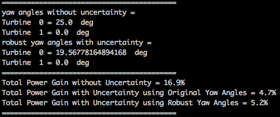

example_0010a_optimize_yaw_robust.py
====================================

The code for this example can be found here: `example_0010a_optimize_yaw_robust.py 
<https://github.com/NREL/floris/blob/develop/examples/example_0010a_optimize_yaw_robust.py>`_

This example uses the :py:class:`YawOptimization<floris.tools.optimization.YawOptimization>` 
class in the :py:mod:`optimization<floris.tools.optimization>` module to determine the optimial 
yaw angles for a two-turbine array for a single wind speed and direction with and without uncertainty 
in wind direction and yaw angle. When uncertainty is included in the optimization, the optimal yaw angles are considered robust. The optimization function accepts the floris interface instance and bounds on the yaw angles, and returns the optimal angles. 

Uncertainty in wind direction and yaw position 
is modeled by including a distribution of wind direction and yaw angle deviations about the desired 
wind direction and yaw angle when calculating wind farm power. The uncertainty in wind direction and 
yaw angle is modeled using independent normal distributions of the wind direction and yaw angle deviations. Wind farm 
power is calculated as the weighted sum of the power for different wind direction - yaw angle combinations, 
weighted according to the probability of occurance according to the normal distributions. This example explores the impact of uncertainty on power production when both original and robust optimal yaw angles are used.

The initial setup is defined here. The dictionary 'unc_options' defines the parameters used when including wind direction and yaw uncertainty: the standard deviation values of the normally-distributed wind direction and yaw angle uncertainty are 4.95 degrees and 1.75 degrees, respectively. The resolution of the probability mass functions (PMFs) for wind direction and yaw uncertainty is 1 degree. The tails of the PMFs are truncated to include the 1st to 99th percentiles.

::

    # Set turbine locations to a 2 turbine array
    D = fi.floris.farm.turbines[0].rotor_diameter
    layout_x = [0, 5*D]
    layout_y = [0, 0]
    fi.reinitialize_flow_field(layout_array=(layout_x, layout_y), wind_direction = 273.0)
    fi.calculate_wake()

    unc_options={'std_wd': 4.95, 'std_yaw': 1.75,'pmf_res': 1.0, 'pdf_cutoff': 0.99}

The initial wind farm power is then calculated with and without wind direction and yaw uncertainty:

::

    # Initial power output without uncertainty
    power_initial = fi.get_farm_power()

    # Initial power output with uncertainty
    power_initial_unc = fi.get_farm_power(include_unc=True,
                            unc_options=unc_options)

YawOptimization objects with and without wind direction and yaw uncertainty are initialized using the floris interface instance. Two sets of yaw angles are then optimized: 1) original yaw angles assuming no uncertainty, and 2) robust yaw angles assuming wind direction and yaw uncertainty:

::

    # Set bounds for allowable wake steering
    min_yaw = 0.0
    max_yaw = 25.0

    # Without uncertainty
    # Instantiate the Optimization object
    yaw_opt = YawOptimization(fi,
                                   minimum_yaw_angle=min_yaw, 
                                   maximum_yaw_angle=max_yaw)

    # Perform optimization
    yaw_angles = yaw_opt.optimize()

    # With Uncertainty
    # Instantiate the Optimization object
    yaw_opt = YawOptimization(fi,
                                   minimum_yaw_angle=min_yaw, 
                                   maximum_yaw_angle=max_yaw,
                                   include_unc=True,
                                   unc_options=unc_options)

    # Perform optimization
    yaw_angles_unc = yaw_opt.optimize()

Next, wind farm power is calculated 1) without uncertainty, using the original non-robust yaw angles, 2) with uncertainty, using the original non-robust yaw angles, and 3) with uncertainty, using the robust yaw angles.

::

    # Assign yaw angles to turbines and calculate wake
    fi.calculate_wake(yaw_angles=yaw_angles)
    power_opt = fi.get_farm_power()
    power_opt_unc = fi.get_farm_power(include_unc=True,
                            unc_options=unc_options)
    fi.calculate_wake(yaw_angles=yaw_angles_unc)
    power_opt_unc_robust = fi.get_farm_power(include_unc=True,
                            unc_options=unc_options) 

To determine the gain, the power is compared using the initial angles and the 
optimal angles for the three cases. When wind direction and yaw position uncertainty are included, the power gain from wake steering is lower. But when the robust yaw angles are used, the power gain increases.

