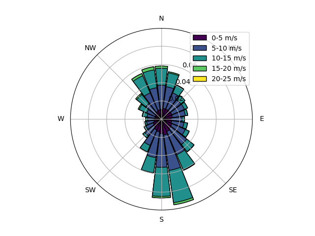
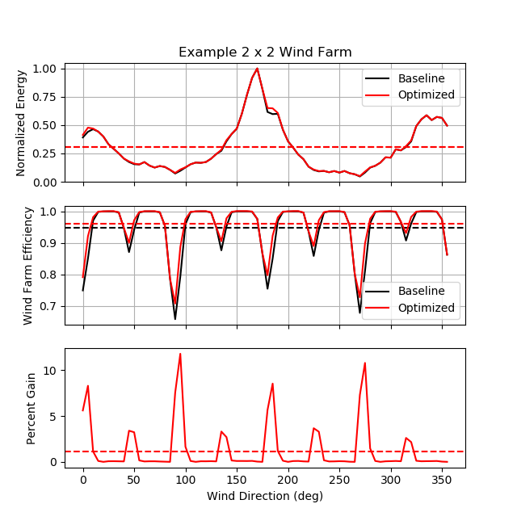
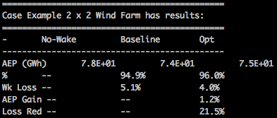

example_0011_optimize_yaw_wind_rose.py
======================================

The code for this example can be found here: `example_0011_optimize_yaw_wind_rose.py 
<https://github.com/NREL/floris/blob/develop/examples/example_0011_optimize_yaw_wind_rose.py>`_

This example uses the :py:class:`YawOptimizationWindRose<floris.tools.optimization.YawOptimizationWindRose>` 
class in the :py:mod:`optimization<floris.tools.optimization>` module to determine the optimal 
yaw angles for a given wind farm for a series of wind speed and direction combinations comprising a wind rose. 
The wind rose information, determined using the :py:class:`WindRose<floris.tools.wind_rose.WindRose>` class in 
the :py:mod:`wind_rose<floris.tools.wind_rose>` module, is then used to calculate the Annual Energy Production 
(AEP) of the wind farm for the baseline and optimized cases. The AEP improvement from wake steering is 
calculated using the :py:class:`PowerRose<floris.tools.wind_rose.PowerRose>` class in 
the :py:mod:`power_rose<floris.tools.power_rose>` module.

The wind farm coordinates and some optimization parameters are specified and the initial setup is computed here:

::

    # Define wind farm coordinates and layout
    wf_coordinate = [39.8283, -98.5795]

    # set min and max yaw offsets for optimization
    min_yaw = 0.0
    max_yaw = 25.0

    # Define minimum and maximum wind speed for optimizing power. 
    # Below minimum wind speed, assumes power is zero.
    # Above maximum_ws, assume optimal yaw offsets are 0 degrees
    minimum_ws = 3.0
    maximum_ws = 15.0

    # Instantiate the FLORIS object
    fi = wfct.floris_interface.FlorisInterface("example_input.json")

    # Set wind farm to N_row x N_row grid with constant spacing 
    # (2 x 2 grid, 5 D spacing)
    D = fi.floris.farm.turbines[0].rotor_diameter
    N_row = 2
    spc = 5
    layout_x = []
    layout_y = []
    for i in range(N_row):
        for k in range(N_row):
            layout_x.append(i*spc*D)
            layout_y.append(k*spc*D)
    N_turb = len(layout_x)

    fi.reinitialize_flow_field(layout_array=(layout_x, layout_y),wind_direction=270.0,wind_speed=8.0)
    fi.calculate_wake()

Next, a WindRose object is initialized and a DataFrame containing the frequency of occurance for a series of wind speed and direction combinations at the specified coordinates is created using data from the `Wind Integration National Dataset (WIND) Toolkit <https://www.nrel.gov/grid/wind-toolkit.html>`_. Note that WIND Toolkit only contains data for the continental United States. Obtaining WIND Toolkit data through the HSDS API requires certain environment variables to be defined, as explained `here <https://github.com/NREL/hsds-examples>`_. As an alternative to using the WIND Toolkit HSDS API, by setting *calculate_new_wind_rose* to *True*, the WindRose object will be populated with pre-generated data. 

::

    calculate_new_wind_rose = True

    wind_rose = rose.WindRose()

    if calculate_new_wind_rose:

        wd_list = np.arange(0,360,5)
        ws_list = np.arange(0,26,1)

        df = wind_rose.import_from_wind_toolkit_hsds(wf_coordinate[0],
                                                            wf_coordinate[1],
                                                            ht = 100,
                                                            wd = wd_list,
                                                            ws = ws_list,
                                                            limit_month = None,
                                                            st_date = None,
                                                            en_date = None)

    else:
        df = wind_rose.load('windtoolkit_geo_center_us.p')

The baseline power and optimized power are found for each wind speed and wind direction combination from the wind rose by creating an instance of the :py:class:`YawOptimizationWindRose<floris.tools.optimization.YawOptimizationWindRose>` class. The :py:meth:`calc_baseline_power()
<floris.tools.optimization.YawOptimizationWindRose.calc_baseline_power>` method is used to find the wind farm power and individual turbine power values for each wind direction and wind speed for baseline and no-wake scenarios. Next, the :py:meth:`optimize()
<floris.tools.optimization.YawOptimizationWindRose.optimize>` method is used to find the optimal wind farm power, individual turbine power values, and optimal yaw offsets for each wind speed and wind direction.

::

    # Instantiate the Optimization object
    yaw_opt = YawOptimizationWindRose(fi, df.wd, df.ws,
                                   minimum_yaw_angle=min_yaw,
                                   maximum_yaw_angle=max_yaw,
                                   minimum_ws=minimum_ws,
                                   maximum_ws=maximum_ws)

    # Determine baseline power with and without wakes
    df_base = yaw_opt.calc_baseline_power()

    # Perform optimization
    df_opt = yaw_opt.optimize()

Finally, an instance of the :py:class:`PowerRose<floris.tools.power_rose.PowerRose>` class is created to calculate the AEP improvement from optimal wake steering. The PowerRose object is intialized using DataFrames containing information about the baseline, no-wake, and optimal power for each wind speed and wind direction as well as the frequencies of occurance determined from the wind rose. 

::

    # Summarize using the power rose module
    power_rose = pr.PowerRose()
    case_name = 'Example '+str(N_row)+' x '+str(N_row)+ ' Wind Farm'

    # combine wind farm-level power into one dataframe
    df_power = pd.DataFrame({'ws':df.ws,'wd':df.wd, \
        'freq_val':df.freq_val,'power_no_wake':df_base.power_no_wake, \
        'power_baseline':df_base.power_baseline,'power_opt':df_opt.power_opt})

    # initialize power rose
    df_yaw = pd.DataFrame([list(row) for row in df_opt['yaw_angles']],columns=[str(i) for i in range(1,N_turb+1)])
    df_yaw['ws'] = df.ws
    df_yaw['wd'] = df.wd
    df_turbine_power_no_wake = pd.DataFrame([list(row) for row in df_base['turbine_power_no_wake']],columns=[str(i) for i in range(1,N_turb+1)])
    df_turbine_power_no_wake['ws'] = df.ws
    df_turbine_power_no_wake['wd'] = df.wd
    df_turbine_power_baseline = pd.DataFrame([list(row) for row in df_base['turbine_power_baseline']],columns=[str(i) for i in range(1,N_turb+1)])
    df_turbine_power_baseline['ws'] = df.ws
    df_turbine_power_baseline['wd'] = df.wd
    df_turbine_power_opt = pd.DataFrame([list(row) for row in df_opt['turbine_power_opt']],columns=[str(i) for i in range(1,N_turb+1)])
    df_turbine_power_opt['ws'] = df.ws
    df_turbine_power_opt['wd'] = df.wd

    power_rose.initialize(case_name, df_power, df_yaw, df_turbine_power_no_wake, df_turbine_power_baseline, df_turbine_power_opt)

    fig, axarr = plt.subplots(3, 1, sharex=True, figsize=(6.4, 6.5))
    power_rose.plot_by_direction(axarr)
    power_rose.report()

The :py:meth:`plot_by_direction()
<floris.tools.power_rose.PowerRose.plot_by_direction>` method is used to provide plots of the energy production and energy gain with wake steering as a function of wind direction. 

The :py:meth:`report()
<floris.tools.power_rose.PowerRose.report>` method provides a summary of the AEP improvement from wake steering.

