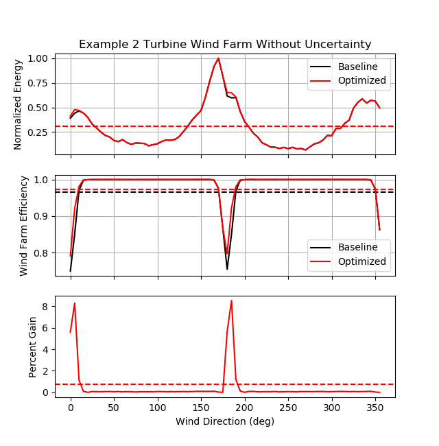
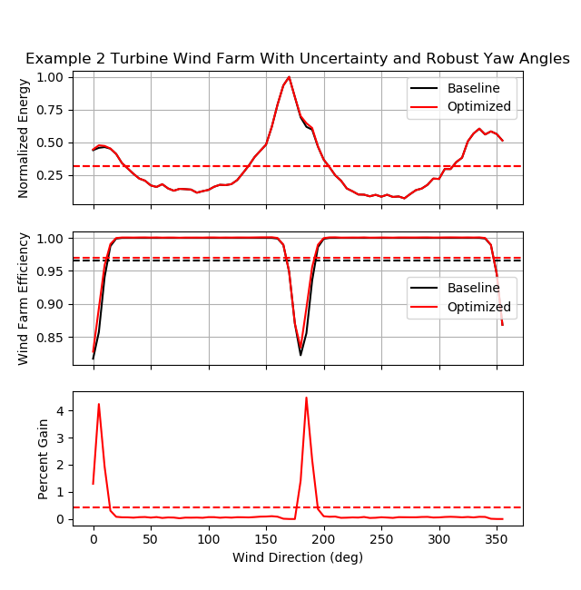
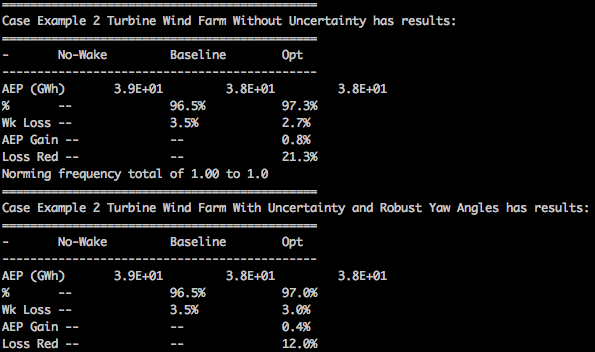

example_0011a_optimize_yaw_wind_rose_robust.py
==============================================

The code for this example can be found here: `example_0011a_optimize_yaw_wind_rose_robust.py 
<https://github.com/NREL/floris/blob/develop/examples/example_0011a_optimize_yaw_wind_rose_robust.py>`_

This example shows how to use the :py:class:`YawOptimizationWindRose<floris.tools.optimization.YawOptimizationWindRose>` 
class in the :py:mod:`optimization<floris.tools.optimization>` module to determine the optimal 
yaw angles for a given wind farm for a series of wind speed and direction combinations comprising a wind rose, with and without wind direction and yaw angle uncertainty. Note that only wind direction uncertainty is included in this example, however. The wind rose information, determined using the :py:class:`WindRose<floris.tools.wind_rose.WindRose>` class in the :py:mod:`wind_rose<floris.tools.wind_rose>` module, is then used to calculate the Annual Energy Production (AEP) of the wind farm for the baseline and optimized cases with and without uncertainty. The AEP improvements from wake steering are calculated using the :py:class:`PowerRose<floris.tools.wind_rose.PowerRose>` class in the :py:mod:`power_rose<floris.tools.power_rose>` module.

Uncertainty in wind direction and yaw position is modeled by including a distribution of wind direction and yaw angle deviations about the desired wind direction and yaw angles when calculating wind farm power. The uncertainty in wind direction and yaw angle is modeled using independent normal distributions of the wind direction and yaw angle deviations. Wind farm power is calculated as the weighted sum of the power for different wind direction - yaw angle combinations, weighted according to the probability of occurance according to the normal distributions. This example compares the AEP gain with optimal wake steering with and without wind direction and yaw uncertainty. When uncertainty is included in the optimization, the optimal yaw angles are considered robust.

First, the wind farm coordinates and some optimization parameters are specified and the initial setup is computed for a 2-turbine array. The dictionary 'unc_options' defines the parameters used when including wind direction and yaw uncertainty. Note that only wind direction uncertainty is considered in this example to improve the execution speed. The standard deviation values of the normally-distributed wind direction and yaw angle uncertainty are 4.95 degrees and 0.0 degrees, respectively. The resolution of the probability mass functions (PMFs) for wind direction and yaw uncertainty is 1 degree. The tails of the PMFs are truncated to include the 5th to 95th percentiles.

::

    # Define wind farm coordinates and layout
    wf_coordinate = [39.8283, -98.5795]

    # set min and max yaw offsets for optimization
    min_yaw = 0.0
    max_yaw = 25.0

    # Define minimum and maximum wind speed for optimizing power. 
    # Below minimum wind speed, assumes power is zero.
    # Above maximum_ws, assume optimal yaw offsets are 0 degrees
    minimum_ws = 3.0
    maximum_ws = 15.0

    # Instantiate the FLORIS object
    fi = wfct.floris_interface.FlorisInterface("example_input.json")

    # Set wind farm to a 2 turbine N-S configuration with 5D spacing 
    D = fi.floris.farm.turbines[0].rotor_diameter
    spc = 5
    layout_x = [0, 0]
    layout_y = [0, 5*D]
    N_turb = len(layout_x)

    fi.reinitialize_flow_field(layout_array=(layout_x, layout_y),wind_direction=270.0,wind_speed=8.0)
    fi.calculate_wake()

    unc_options={'std_wd': 4.95, 'std_yaw': 0.0,'pmf_res': 1.0, 'pdf_cutoff': 0.95}

Next, a WindRose object is initialized, as described in :doc:`Example 0011 <example_0011>`. 

.. image:: ../../_static/images/WindRose_Example.png

The baseline power and optimized power with and without wind direction uncertainty are found for each wind speed and wind direction combination from the wind rose by creating instances of the :py:class:`YawOptimizationWindRose<floris.tools.optimization.YawOptimizationWindRose>` class with and without uncertainty. The :py:meth:`calc_baseline_power()
<floris.tools.optimization.YawOptimizationWindRose.calc_baseline_power>` method is used to find the wind farm power and individual turbine power values for each wind direction and wind speed for baseline and no-wake scenarios. The :py:meth:`optimize()
<floris.tools.optimization.YawOptimizationWindRose.optimize>` method is used to find the optimal wind farm power, individual turbine power values, and optimal yaw offsets for each wind speed and wind direction.

::

    # Without uncertainty
    # Instantiate the Optimization object
    yaw_opt = YawOptimizationWindRose(fi, df.wd, df.ws,
                                   minimum_yaw_angle=min_yaw,
                                   maximum_yaw_angle=max_yaw,
                                   minimum_ws=minimum_ws,
                                   maximum_ws=maximum_ws)

    # Determine baseline power with and without wakes
    df_base = yaw_opt.calc_baseline_power()

    # Perform optimization
    df_opt = yaw_opt.optimize()

    # With uncertainty
    # Instantiate the Optimization object
    yaw_opt = YawOptimizationWindRose(fi, df.wd, df.ws,
                                   minimum_yaw_angle=min_yaw,
                                   maximum_yaw_angle=max_yaw,
                                   minimum_ws=minimum_ws,
                                   maximum_ws=maximum_ws,
                                   include_unc=include_unc,
                                   unc_options=unc_options)

    # Determine baseline power with and without wakes
    df_base_unc = yaw_opt.calc_baseline_power()

    # Perform optimization
    df_opt_unc = yaw_opt.optimize()

Finally, instances of the :py:class:`PowerRose<floris.tools.power_rose.PowerRose>` class are created to calculate the AEP improvement from optimal wake steering with and without uncertainty. Similar to :doc:`Example 0011 <example_0011>`, PowerRose objects are intialized using the DataFrames for the cases with and without uncertainty containing information about the baseline, no-wake, and optimal power for each wind speed and wind direction as well as the frequencies of occurance determined from the wind rose. 

For the baseline and optimization results with and without uncertainty, the :py:meth:`plot_by_direction()
<floris.tools.power_rose.PowerRose.plot_by_direction>` method is used to provide plots of the energy production and energy gain with wake steering as a function of wind direction. 

The :py:meth:`report()
<floris.tools.power_rose.PowerRose.report>` method provides a summary of the AEP improvement from wake steering for the cases with and without wind direction uncertainty.

Note that with wind direction uncertainty included, the AEP gain from optimal wake steering with robust yaw angles is roughly half of the gain without uncertainty.