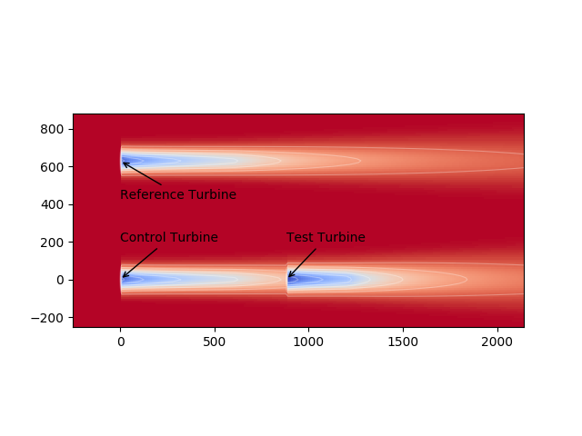

example_0030_demo_energy_ratio.py
======================================

The code for this example can be found here: 
`example_0030_demo_energy_ratio.py
<https://github.com/NREL/floris/blob/develop/examples/example_0030_demo_energy_ratio.py>`_

This example uses FLORIS to demonstrate the energy ratio method used in analyzing field campagin data.
A version of this code is used for example in the paper:
`Initial results from a field campaign of wake steering applied at a commercial wind farm – Part 1
<https://www.wind-energ-sci.net/4/273/2019/wes-4-273-2019.html>`_

The example sets up a FLORIS farm in which a simulated controller (which simply sets an upstream
turbine to have a fixed 20 deg offset is tested).  The farm consists of a control turbine which implements
the strategy, a downstream turbine effect by this change, and a reference turbine not-impacted.  The farm is shown here:

After setting the farm, the farm is simulated using random wind speed directions with the upstream turbine aligned (Baseline)
or set to 20 degrees offset in yaw (controlled).  The power of the reference and test turbine are saved in arrays in this block
for the baseline case:

::

    # Initialize the arrays for baseline
    ref_pow_base = np.zeros(n_sim)
    test_pow_base = np.zeros(n_sim)
    ws_base = np.random.uniform(low=5,high=15.,size=n_sim)
    wd_base = wd_var_scale * (np.random.rand(n_sim) - 0.5) + 270.

    # Run the baseline
    for i, (ws,wd) in enumerate(zip(ws_base,wd_base)):
        fi.reinitialize_flow_field(wind_speed=ws, wind_direction=wd)
        fi.calculate_wake()
        turb_powers = fi.get_turbine_power()
        ref_pow_base[i] = turb_powers[1] # The unaffacted second turbine
        test_pow_base[i] = turb_powers[2] # The downstream turbine

These saved arrays are then used to demonstrate the balanced energy ratio methods in the final block

::

    fig, axarr = plt.subplots(3,1,sharex=True,figsize=(10,10))

    plot_energy_ratio(ref_pow_base,test_pow_base,ws_base,wd_base,
                        ref_pow_con,test_pow_con,ws_con,wd_con,
                        wd_bins, plot_simple=False, axarr=axarr, label_array=['Field Baseline', 'Field Controlled'],
                        label_pchange='Field Gain' )